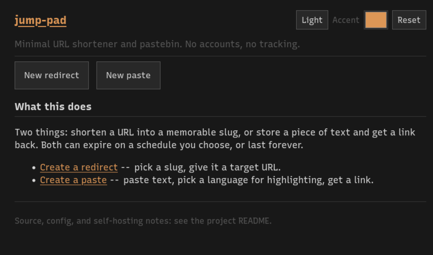
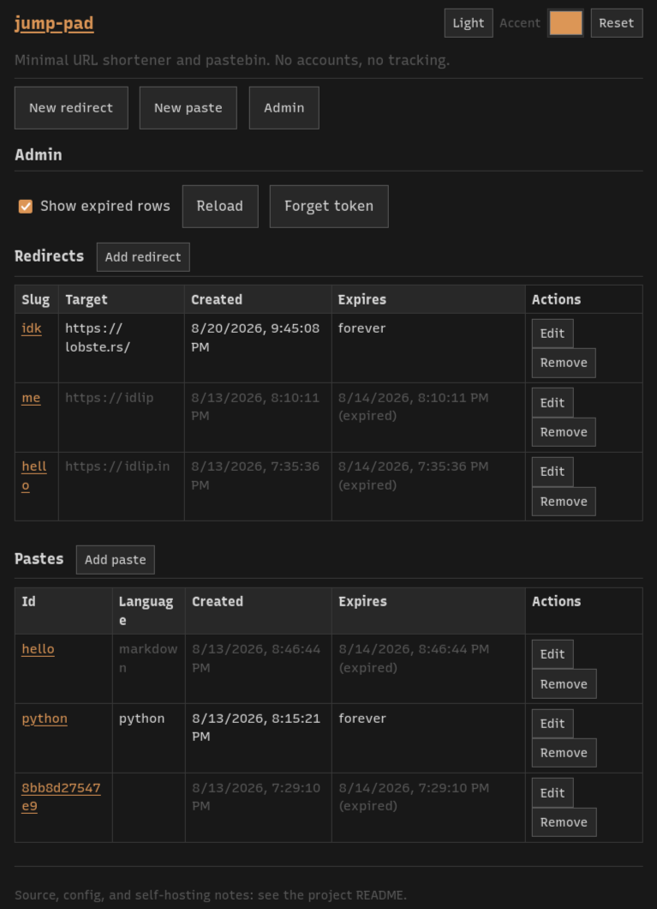

* jump-pad
:PROPERTIES:
:CUSTOM_ID: jump-pad
:END:

Minimal URL shortener + pastebin. Single binary, SQLite storage, no framework or complication.
Tool is kept bare metal and to be absolute minimal. It should just work and no need regular maintenance.
The intention is to make it work forever, thus wholly stays vanilla in implementation.

- Inspired by [[https://news.ycombinator.com/][Hacker news]], [[https://lobste.rs/][Lobste.rs]] and [[https://miniflux.app/opinionated.html][Miniflux]] to stay opinionated and with no BS. It works and it needs no cosmetic bloat.

** Demo

- Jump pad default UI showing redirect and paste as option.

- Jump pad Admin UI shown to edit or remove entries

- Jump pad workflow recording
[[https://github.com/user-attachments/assets/18587633-6960-4d05-a770-35e8f9c5c5e1]]

** Features

- *Core* :: Shortener - Helps in redirect URLs very easily in an instant without any network queue.
  Pastebin - Dispense text to share and easily fetch over network.

- *Configurable* :: Be completely override-able and add tweak to full extent.
  The main intention of this tool is to make it work absolutely and overriding parts for cosmetics and naming can be configured for hosting.

- *Minimal* :: Stay minimal and do the given job correctly.
  It must only do its purpose as tool and not add cognitive load to user.

- *Secure* :: Only admin can manage or delete entries and no attacker can intrude to de-crypt or leak data.
  Security will be considered as the primary goal after functionality.

- *Binary* :: Tool stays in single binary, can run anywhere and must work as expected anytime.
  No headache, even compiling should be instant.

- *Reproducible* :: Tool should stay reproducible and more over must work even after maintenance gap or no updates.
  Backend stays simple DB add and remove. Frontend stays vanilla Html+Css+JS which must never break.

- *Documentation* :: _Code as Docs_. Code must be for human, and talk must be for human as well.
  Make code readable and easy for contribution or corrections, make every function atomic to keep it simple and add tests to dictate determinism.
  Documentation via readme is for quick start users to get started and have the taste of suckless tool.

- *Philosophy* :: Tool follows inspiration from [[https://www.gnu.org/software/emacs/][Emacs]], [[https://lobste.rs/][Lobste.rs]], [[https://miniflux.app/opinionated.html][Miniflux]], [[https://github.com/knadh/listmonk/][Listmonk]]. Follows [[https://en.wikipedia.org/wiki/Unix_philosophy][Unix philosophy]] in functionality and [[https://suckless.org/philosophy/][Suckless philosophy]] to keep it devoid of BS.

** Routes
:PROPERTIES:
:CUSTOM_ID: routes
:END:
| Method | Path                                     | Auth  | Notes                                                                        |
|--------+------------------------------------------+-------+------------------------------------------------------------------------------|
| POST   | =/redirects=                               | yes   | form: =slug=, =target_url=, =expiry=                                               |
| GET    | ={redirect_prefix}{slug}=                  | no    | 301 to target, 404, or 410 if expired; prefix defaults to =/=                  |
| POST   | =/pastes=                                  | yes   | form: =content=, =language=, =expiry=; 500KB cap                                   |
| GET    | ={paste_prefix}{id}=                       | no    | raw text + =X-Paste-Language= header, 404, or 410; prefix defaults to =/pastes/= |
| GET    | =/=, =/new-redirect=, =/new-paste=, =/view/{id}= | no    | same single-page frontend for all four; client-side JS picks the view        |
| GET    | =/static/*=                                | no    | frontend assets (style.css, app.js, vendored highlight.js)                   |
| GET    | =/admin=                                   | no    | admin page shell; the page is public, its API is not                         |
| *      | =/admin/api/*=                             | admin | only registered when =admin_token= is set; see [[#admin][Admin]]                           |

=expiry= accepts =1d=, =1w=, =1m=, any =time.ParseDuration= string (e.g. =72h=), or empty for forever.=language= is
a free-form hint (e.g. =python=) used for syntax highlighting on =/view/{id}=; omit for plaintext.

** Config
:PROPERTIES:
:CUSTOM_ID: config
:END:
Layered: built-in defaults -> config file (=-config path=) -> CLI flags.
Config file is plain =key=value= (see =deploy/jump-pad.conf.example=).

| Key             | Flag             | Default            |
|-----------------+------------------+--------------------|
| =addr=            | =-addr=            | =:8080=              |
| =db_path=         | =-db=              | =jumppad.db=         |
| =auth_token=      | =-token=           | /(none, open)/       |
| =admin_token=     | =-admin-token=     | /(none, admin off)/  |
| =web_dir=         | =-web-dir=         | /(embedded default)/ |
| =redirect_prefix= | =-redirect-prefix= | /(root, =/=)/          |
| =paste_prefix=    | =-paste-prefix=    | =/pastes/=           |

=auth_token=, if set, is required on POST routes as either the =X-Auth-Token= header or a =?token== query
param.GET routes are always open.=redirect_prefix=/=paste_prefix= must resolve to different values
(checked at startup) e.g. set =/r/= and =/p/= for short vanity paths, or leave paste_prefix at its
default and just set =redirect_prefix = /r/=.

** Admin
:PROPERTIES:
:CUSTOM_ID: admin
:END:

One page at =/admin= lists, adds, edits, and removes every redirect and every paste, so managing what
exists needs no =sqlite3=. The admin is the person who runs the server, and that person already has the
database file, so the page is convenience over what they can already do.

| Method | Path                        | Notes                                                       |
|--------+-----------------------------+-------------------------------------------------------------|
| GET    | =/admin/api/items=            | both tables, expired rows included; pastes carry no content |
| GET    | =/admin/api/pastes/{id}=      | one paste with its content, expired or not                  |
| POST   | =/admin/api/redirects=        | add; 201 with the final slug                                |
| PUT    | =/admin/api/redirects/{slug}= | full replacement, a rename included; 204, or 409 if taken   |
| DELETE | =/admin/api/redirects/{slug}= | 204, or 404                                                 |
| POST   | =/admin/api/pastes=           | add; 201 with the final id                                  |
| PUT    | =/admin/api/pastes/{id}=      | full replacement, a rename included; 204, or 409 if taken   |
| DELETE | =/admin/api/pastes/{id}=      | 204, or 404                                                 |

** Overriding Frontend
:PROPERTIES:
:CUSTOM_ID: frontend
:END:

One page (=internal/httpserver/web/index.html=) is served for every page route above; =app.js=
shows/hides the right section based on the URL and talks to the API with =fetch()=. Zero custom CSS
classes, every rule in =static/style.css= targets a native element, an id, or an attribute. Colors
are [[https://github.com/chriskempson/base16][base16]]: swap the =--base0X= values for any published base16 scheme to reskin completely. Layout is
deliberately dense/undecorated (Hacker News / lobste.rs / Miniflux inspired) -- content over chrome,
no cards or shadows. Hosters can modify theme or page itself by giving an flag which replaces the file.

Point =web_dir= at your own customized page (same =index.html= + =static/= layout, including
=static/vendor/highlight.min.{js,css}=) to rebrand without rebuilding, picked up live, no restart needed.

Syntax highlighting is [[https://highlightjs.org/][highlight.js]] (BSD-3, vendored under =static/vendor/=, license included), both
live while typing a paste and when viewing one.

** Running
:PROPERTIES:
:CUSTOM_ID: running
:END:

I bet you it compiles within 4-20 seconds. You can compile it yourself

- Raw binary: =just build && ./jump-pad -config jump-pad.conf=, or =just dev= for a quick live-test loop

- systemd: copy =deploy/jump-pad.service=, adjust paths, =systemctl enable --now jump-pad=

- Nix: =just nix-build= (or =nix build .#default=); =nix develop= for the dev shell (go, gopls, delve,
  gotools, sqlite3, just)

- =just --list= for all quick commands (build/dev/test/nix-build/clean)

** Tests
:PROPERTIES:
:CUSTOM_ID: tests
:END:

=just test= (or =go test ./...=) :: table-driven, one core test per behavior, no mocks (real in-memory
SQLite via =modernc.org/sqlite=).

** Roadmap
:PROPERTIES:
:CUSTOM_ID: roadmap
:END:

- [X] Admin UI: table viewer + export/import

- [ ] Scheduled (delayed-activation) link. Future links to appear on x to y?

- [ ] Access control (coupons/tokens)
  Kinda for polling feature to have quiz here as well. Each entry needs "password" to modify and read?

- [ ] Public listing page. Submitters can choose if any entry can be public to aggregate and show?
  Imo bad idea as things go exploited, but internally for org and group of people might be usefull
  This can do rss feed as well if so.

- [ ] Visit limits on entries. Close after X number of visits. Safe to keep it "first N number serve"

- [ ] Per-paste content encryption, if admin also should not see, then access control cannot suffice here.

- [ ] Report nudge. In case of anamolies for hoster to nudge

- [ ] File drop. Like a mini storage or file server?
  Caddy is better option, but we can do in small way

- [ ] Forms / polling / quiz -- one engine
  Basically if can expand into another package, do web form, quiz and polling.

- [ ] QR code generation, after all above features, then may depend on qr lib to provide QR code for links
  This QR can be customized as per hosting config or per submitter as well (full power), to add logo at mid and so on

- [ ] Rate limiting, user might ping many times. Safe to add some sensible IP limit?

- [ ] Domain blocklist, just an edgecase to provide so hoster can decide?
